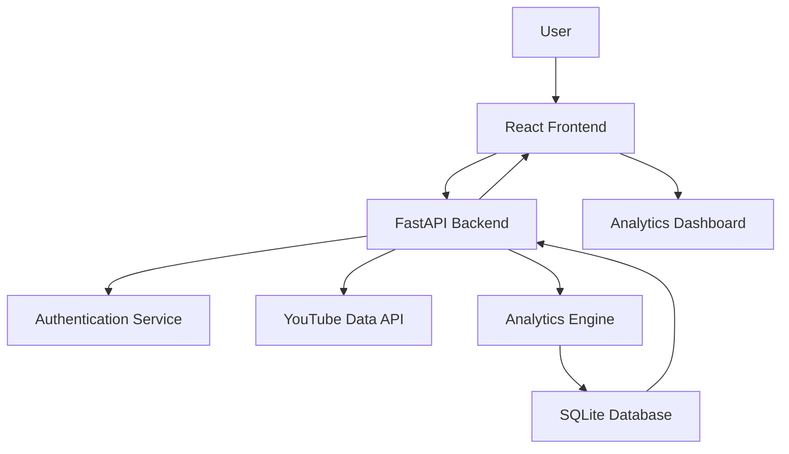

# YouTube Analytics Dashboard

## Overview

YouTube Analytics Dashboard is a full-stack web application that enables users to analyze YouTube channels, track performance metrics, and gain actionable insights through interactive dashboards. The platform provides authenticated access to channel analytics, historical data tracking, and competitor comparison features to help creators, marketers, and businesses make data-driven decisions.

Built with React, FastAPI, Python, and SQLite, the application follows a scalable architecture with secure authentication, persistent data storage, and efficient analytics processing.

---

## Features

* Secure user authentication and authorization
* YouTube channel performance analysis
* Interactive analytics dashboard
* Historical data tracking and visualization
* Competitor channel comparison
* Key performance metric analysis
* Personalized user dashboard
* Data persistence and report storage
* Responsive and user-friendly interface

---

## Tech Stack

### Frontend

* React.js
* JavaScript
* HTML5
* CSS3

### Backend

* Python
* FastAPI

### Database

* SQLite

### Authentication

* JWT Authentication

### Data Processing

* YouTube Data API
* Python Data Analysis Libraries

### Development Tools

* Git
* GitHub

---

## Architecture



---

## How It Works

1. Users create an account and securely log in.
2. The user enters a YouTube channel URL or channel ID.
3. The backend fetches channel data using the YouTube Data API.
4. Analytics services process channel statistics and performance metrics.
5. Processed data is stored in the SQLite database for future reference.
6. Users can view interactive dashboards and historical trends.
7. Competitor analysis compares multiple channels across key metrics.
8. Insights are displayed through visualizations and performance summaries.

---

## Key Metrics Analyzed

* Subscriber Count
* Total Views
* Video Count
* Average Views per Video
* Channel Growth Trends
* Engagement Indicators
* Upload Frequency
* Historical Performance Data
* Competitor Performance Comparison

---

## Performance & Scalability

* Designed using a modular full-stack architecture.
* Efficient API communication between frontend and backend.
* Persistent data storage for historical analytics.
* Optimized database queries for faster dashboard loading.
* Scalable backend structure to support future feature expansion.

---

## Project Structure

```text
youtube-analytics-dashboard/
│
├── frontend/
│   ├── src/
│   ├── components/
│   ├── pages/
│   └── services/
│
├── backend/
│   ├── api/
│   ├── routes/
│   ├── models/
│   ├── services/
│   └── authentication/
│
├── database/
│   └── sqlite/
│
├── analytics/
│   ├── channel-analysis/
│   ├── competitor-analysis/
│   └── reporting/
│
└── docs/
```

---

## Future Enhancements

* AI-powered channel growth recommendations
* Advanced engagement analysis
* Sentiment analysis of comments
* Export reports in PDF and Excel formats
* Multi-platform social media analytics
* Real-time channel monitoring
* Automated competitor tracking

---

## Key Learnings

Through this project, I gained hands-on experience with:

* Full-Stack Web Development
* React.js Frontend Development
* FastAPI Backend Development
* RESTful API Design
* User Authentication & Authorization
* Database Design and Management
* Data Analysis and Visualization
* YouTube API Integration
* Scalable Application Architecture

---

## Author

**Jyoti Sharma**

B.Tech Information Technology | Full-Stack Developer

Passionate about building scalable web applications, analytics platforms, and data-driven solutions.
